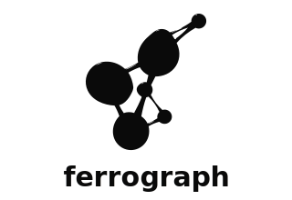

<p align="center">
  
</p>

Graph-powered Rust code intelligence. Indexes Rust codebases into a queryable knowledge graph with CLI and MCP interfaces.

## Status

Implements file discovery, tree-sitter AST extraction (functions, structs, enums, traits, impls, consts, statics, macros, modules), `mod`/`use` resolution with Imports edges, call graph construction (same-file and cross-file via imports; includes calls inside macro invocations such as `format!()` and `println!()`), dead code detection (`pub`, `main`, `#[test]`, and `#[bench]` entry points), CozoDB graph storage, CLI (index, query, search, status, watch), MCP server with 10 tools (`reindex`, `status`, `search`, `node_info`, `dead_code`, `blast_radius`, `callers`, `query`, `trait_implementors`, `module_graph`), and optional git change-coupling analysis. Node IDs are relative to the project root (e.g. `./src/main.rs#10:1`). Trait/ownership resolution is stubbed for future rust-analyzer integration.

## Build

```bash
cargo build --release
cargo test
cargo clippy -- -D warnings
```

## Usage

```bash
# Index current directory (in-memory)
cargo run -- index .

# Index to a persistent database
cargo run -- index . --output .ferrograph

# Run Datalog queries (requires a persistent database)
cargo run -- query --db .ferrograph "?[id, type, payload] := *nodes[id, type, payload]"
cargo run -- query --db .ferrograph "?[id] := *dead_functions[id]"

# Text search over node payloads (use -c for case-insensitive)
cargo run -- search --db .ferrograph "main"
cargo run -- search --db .ferrograph -c "greet"

# Show graph stats
cargo run -- status .

# Watch for changes and re-index (--output required)
cargo run -- watch . --output .ferrograph

# Run MCP server over stdio (for AI agents / IDEs).
# The server looks for a graph at FERROGRAPH_DB or .ferrograph in the current directory.
# Set FERROGRAPH_DB to the path of your index to use a specific graph.
cargo run -- mcp
```

**MCP configuration:** The MCP server looks for a graph at `FERROGRAPH_DB` or `.ferrograph` in the project directory. You can bootstrap an index from scratch using the `reindex` tool (no CLI step required), or run `ferrograph index --output .ferrograph` first. Set `FERROGRAPH_DB` to the path of your database file to use a specific graph.

### MCP tools

Node IDs use the format `./path/to/file.rs#line:col` (relative to the project root).

| Tool | Description |
|------|-------------|
| `reindex` | Re-index the project; can bootstrap from scratch (no pre-existing DB needed). |
| `status` | Node/edge counts, DB path, `indexed_at` timestamp. |
| `search` | Text search over node payloads; supports limit/offset pagination. |
| `node_info` | Type, payload, and incoming/outgoing edges for a node ID. |
| `dead_code` | Functions not reachable from entry points; optional `node_type` and `file_glob` filters. |
| `blast_radius` | Transitive impact set via calls, references, and changes_with edges. |
| `callers` | Direct and transitive callers up to a given depth. |
| `query` | Raw Datalog queries (read-only; mutations rejected). |
| `trait_implementors` | Find implementations of a named trait (stub; returns empty with note). |
| `module_graph` | File-to-module containment edges; optional relative path prefix filter (e.g. `./src/`). |

## Graph schema (edge types)

The schema defines 11 edge types; in v1 only a subset are populated:

| Edge type           | v1 populated | Notes |
|---------------------|-------------|-------|
| `contains`          | Yes         | File/module containment. |
| `imports`           | Yes         | From `mod`/`use` resolution. |
| `calls`             | Yes         | Same-file and cross-file (via imports) calls. |
| `references`        | No          | Planned (e.g. type mentions). |
| `implements_trait`  | No          | Planned (rust-analyzer integration). |
| `owns`              | No          | Planned. |
| `borrows`           | No          | Planned. |
| `expands_to`        | No          | Macro expansion. |
| `uses_unsafe`       | No          | Planned. |
| `lifetime_scope`    | No          | Planned. |
| `changes_with`      | Yes (requires `git` feature) | Git change coupling (optional feature). |

## Publishing

Published to [crates.io](https://crates.io/crates/ferrograph). `Cargo.toml` pins rayon to `>=1.5, <1.11` because cozo's transitive `graph_builder` 0.4.1 is incompatible with rayon 1.11+. This pin does not affect end users.

See [CHANGELOG.md](CHANGELOG.md) for version history.

## License

MIT
